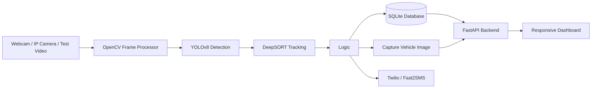

# System Architecture

## Components

- `backend/detection.py`: YOLOv8 inference, violation rules, image capture, and frame annotation.
- `backend/tracking.py`: DeepSORT vehicle tracking.
- `backend/database.py`: SQLite table creation and query helpers.
- `backend/notification.py`: Twilio and Fast2SMS SMS adapters.
- `backend/main.py`: FastAPI app, video streaming, API routes, and dashboard serving.
- `frontend/`: Live dashboard UI.
