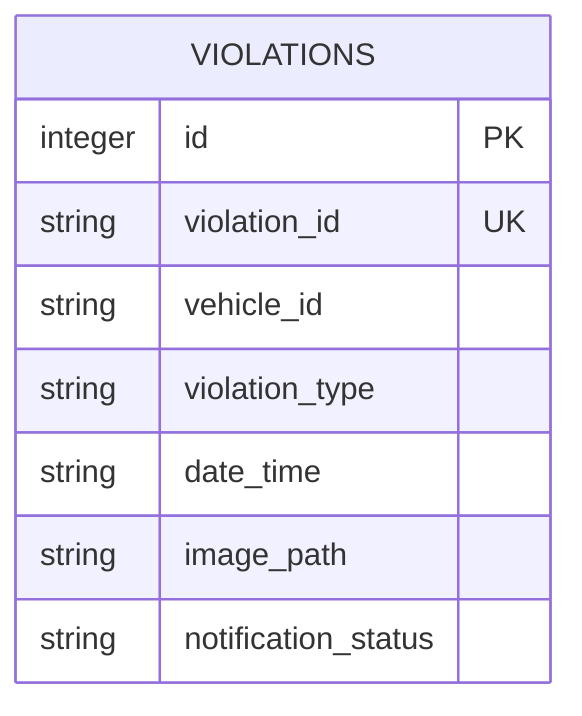

# ER Diagram

## Table Description

`violations` stores every detected traffic violation with the tracked vehicle ID, violation category, evidence image path, timestamp, and SMS notification status.
